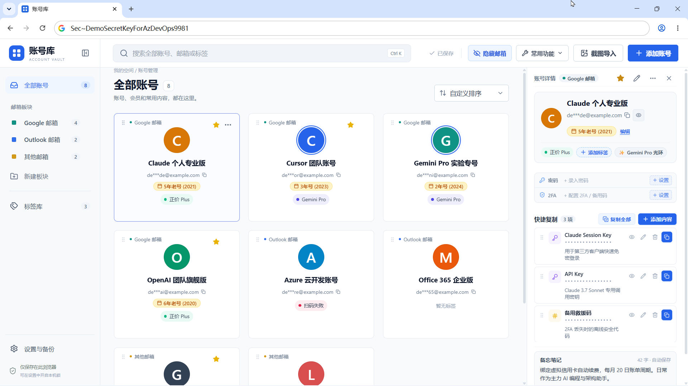
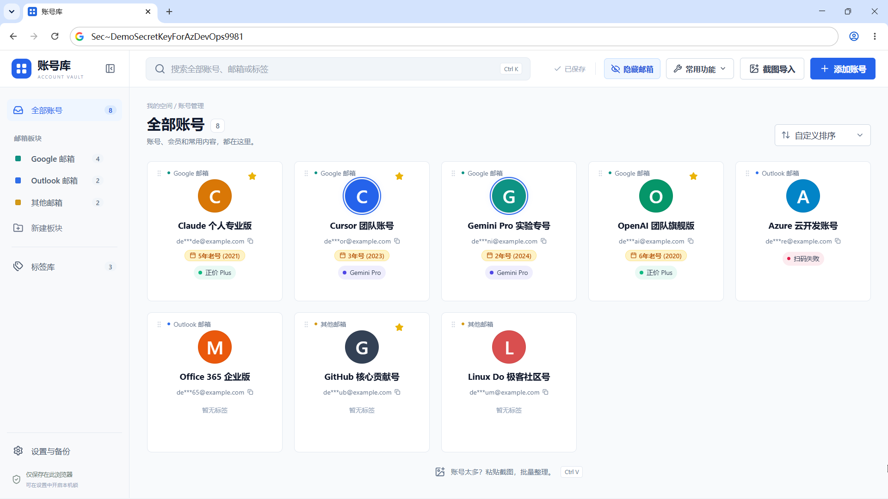

# Account Vault · 账号库

> **我攒了一堆谷歌号。邮箱我记不住，但头像我记得住。**

一个**靠头像认账号**的本地账号管理工具。

粘贴账号列表截图，自动抠出头像并识别邮箱，整理为便于辨认的卡片。数据仅存于浏览器本地，不联网、不上传、无后端。

<p align="center">
  
</p>

<p align="center"><sub>每个账号带真实头像，扫一眼就知道哪个是哪个</sub></p>

<p align="center">
  
</p>

<p align="center"><sub>邮箱脱敏显示，点击即可复制</sub></p>

> **状态**：个人自用项目，持续迭代中。核心功能可用，欢迎提 Issue。

---

## 为什么做这个

账号数量一多，主要问题不是记不住密码，而是难以辨认：

- **邮箱名高度相似** —— `xk3n8d@gmail.com` 与 `xk3n8b@gmail.com` 难以区分
- **密码管理器不适用** —— Bitwarden、KeePass 仅存纯文本，需逐条点开查看
- **截图散落难查** —— 相册中数十张账号截图，检索成本高
- **人脑识图快于识字** —— 头像可一眼确认，邮箱需逐个读取

因此本工具的定位是：**粘贴截图，自动抠出头像与邮箱，之后依靠头像辨认账号。**

---

## 核心能力：截图 → 头像 → 辨认

<p align="center"><b>粘贴截图 &nbsp;→&nbsp; 自动抠出头像 + 邮箱 &nbsp;→&nbsp; 靠头像认号</b></p>

### 头像抠取

在头像位置逐个采样像素，按颜色分布判定类型：

| 情况 | 判定依据 | 处理方式 |
|---|---|---|
| 真实照片头像 | 颜色杂乱（色簇 >10 种，主色占比 <38%） | 裁剪原图存为头像图片 |
| 首字母色块 | 颜色单一 | 还原为同色字母头像 |

首字母头像的颜色从截图中读取，非随机生成。识别结果支持手动修改。

### 截图 OCR 导入

- `Ctrl V` 直接粘贴，无需先保存文件
- 全程本地识别（浏览器内 WASM 运行 tesseract），截图不上传
- 自动拆分邮箱与昵称
- 自动查重，标记「已存在」与「本批重复」
- 结果逐条可勾选、可修改，确认后导入

---

## 其他功能

### ➕ 手动添加

除截图导入外，可手动录入单个账号。主界面右上角提供入口，空板块与无搜索结果页的空状态中亦有入口。

| 字段 | 说明 |
|---|---|
| 头像 | 上传图片，或首字母配色块 |
| 名称 / 邮箱 | 手动输入 |
| 板块 | 选择或新建 |
| 标签 | 从标签库选择 |
| 备注 / 注册时间 / 密码 / 2FA | 选填 |
| 快捷复制项 | 数量不限 |

### 🔐 本地加密

- 可选主密码，PBKDF2-SHA256（250,000 次迭代）派生密钥
- AES-256-GCM 加密整个库，盐值随机、每次加密独立 IV
- 数据存浏览器 IndexedDB，无服务器、无数据库、无上报

### 📁 板块分组

按邮箱类型分组管理，各板块可独立配色（QQ / Google / Outlook / 其他 / 自建）。支持重命名、改色、删除；删除时可将账号迁移至其他板块。

### 🗂️ 标签系统

以标签库形式管理，而非简单字符串：

- 独立标签库页面 —— 新建、重命名、改色、删除
- 删除前提示占用情况 —— 「该标签正被 12 个账号使用，删除后将从这些账号移除」
- 一键清理未被使用的空标签
- 搜索覆盖标签名
- 卡片上最多显示 2 个，超出折为 `+3`

适用示例：`长期号`、`已验证`、`学生会员`、`GPT Plus`、`备用`、`即将到期`

### 📋 账号内部空间

每个账号除邮箱与密码外，还可挂载：

- 备注 —— 自由文本
- 注册时间 —— 支持 `2021`、`2021年`、`5年老号`，自动换算账号年龄
- 密码 / 2FA 密钥
- 快捷复制项（数量不限）—— 每项含名称、内容、图标、颜色、备注

快捷复制项字段：

| 字段 | 说明 |
|---|---|
| 标签 | 如「登录口令」「备用邮箱」「API Token」 |
| 内容 | 待复制的文本 |
| 图标 | 自动识别 —— 填「验证码」给数字图标，填「手机」给手机图标，填 `api_key` 给代码图标 |
| 颜色 | 跟随图标自动配色 |
| 敏感保护 | 勾选后在卡片上遮盖，点击显示 |
| 备忘说明 | 如适用场景或过期时间 |

单个账号可挂载登录密码、PIN 码、备用邮箱、恢复码、订单号等，各项独立一键复制，敏感项自动遮盖。

### 🖱️ 交互细节

- 卡片悬停快速复制，无需进入详情
- 拖拽排序（dnd-kit）
- 邮箱脱敏，一键隐藏
- 搜索覆盖名称、邮箱、注册时间、标签、备注
- JSON 导入导出，便于备份与迁移

---

## 和其他账号管理器的区别

| | 本工具 | 普通密码管理器 |
|---|---|---|
| 录入方式 | **粘贴截图，自动识别** | 手动逐条输入 |
| 认号方式 | **靠头像图片** | 靠文字搜索 |
| 账号内部 | **可挂多条快捷复制项** | 通常只有账号/密码/网址 |
| 敏感字段 | **逐项标记遮盖** | 整体加密 |
| 标签 | **独立标签库可管理** | 多为简单分组 |
| 存储 | 浏览器本地 | 通常有云同步 |
| 定位 | 多账号快速辨认 | 全量凭据保管 |

> 本工具不是 Bitwarden / KeePass 的替代品，而是面向「多账号难以辨认」场景的专用工具。

---

## 快速开始

需要 **Node.js 18+**。

```bash
git clone https://github.com/waw666waw666/account-vault.git
cd account-vault
npm install

# 准备 OCR 识别组件（截图导入功能需要，约 8.8MB，仅首次）
npm run setup:ocr

npm run dev
```

打开 http://127.0.0.1:5188/

### Windows 一键启动

仓库自带 `run.bat`，双击即可。脚本会自动检查 Node.js、安装依赖并启动服务。停止服务双击 `stop.bat`。

---

## 怎么用

**截图批量导入（推荐）**

1. 打开 http://127.0.0.1:5188/
2. 将账号列表截图至剪贴板，或准备图片文件
3. 页面内按 `Ctrl V` 粘贴
4. 等待本地 OCR 完成，账号的头像、昵称、邮箱将逐条列出
5. 逐条确认（可改头像、改名称、取消勾选），点击导入
6. 完成后即可依靠头像辨认账号，点击复制邮箱或密码

> 截图来源可为谷歌账号切换列表、邮箱客户端列表，或任何「头像 + 邮箱」并排的界面。

**手动添加**

1. 主界面右上角点击「添加账号」
2. 填写名称、邮箱，选择头像（上传图片或首字母配色）
3. 选择板块与标签，按需补充备注、注册时间、快捷复制项
4. 保存

---

## 命令

| 命令 | 说明 |
| --- | --- |
| `npm run dev` | 启动开发服务器（127.0.0.1:5188） |
| `npm run build` | 类型检查 + 生产构建 |
| `npm run preview` | 预览生产构建 |
| `npm test` | 运行单元测试 |
| `npm run test:watch` | 测试监听模式 |
| `npm run setup:ocr` | 下载 / 复制 OCR 识别组件 |

---

## 关于 OCR 组件

`public/ocr/` 下的文件约 8.8MB，不纳入 Git 仓库（避免仓库臃肿），需运行一次：

```bash
npm run setup:ocr
```

该脚本会：

1. 从 `node_modules` 复制 `worker.min.js` 与 `tesseract-core-simd-lstm.wasm.js`（版本与依赖严格一致，无需联网）
2. 下载 `eng.traineddata` 英文语言包（约 4MB，需联网一次）

若网络受限，可手动下载 [eng.traineddata](https://github.com/tesseract-ocr/tessdata_fast/raw/main/eng.traineddata) 放置于 `public/ocr/lang/` 目录。

> 未准备 OCR 组件时，除截图导入外的功能均可正常使用。

---

## 数据与隐私

**数据存放于浏览器 IndexedDB，与项目目录无关。**

- 清除浏览器数据、更换浏览器或使用无痕模式，数据将丢失
- 建议定期通过「设置与备份」导出 JSON
- 项目不含任何埋点、统计或上报逻辑

### 加密说明

开启主密码后，整个数据仓库以 AES-256-GCM 加密存储：

- 密钥由 PBKDF2-SHA256 派生，迭代 250,000 次
- 盐值随机生成，每次加密使用独立 IV
- **主密码遗失后无法恢复**，请妥善保管

---

## 技术栈

| 层 | 选型 |
| --- | --- |
| 框架 | React 19 |
| 构建 | Vite 8 |
| 语言 | TypeScript 7 |
| 存储 | IndexedDB（无后端） |
| 加密 | Web Crypto API（PBKDF2 + AES-GCM） |
| OCR | tesseract.js 7（WASM，本地运行） |
| 拖拽 | dnd-kit |
| 图标 | lucide-react |
| 测试 | Vitest |

---

## 项目结构

```
account-vault/
├─ index.html                  HTML 入口
├─ vite.config.ts              Vite 配置（开发端口 5188）
├─ package.json
├─ tsconfig*.json              TS 配置（app / node 分离）
├─ run.bat / stop.bat          Windows 一键启动 / 停止
│
├─ src/
│  ├─ main.tsx                 React 挂载
│  ├─ App.tsx                  应用主组件：状态编排、增删改查、视图切换
│  ├─ types.ts                 数据模型（账号 / 板块 / 标签 / 头像 / 快捷复制项）
│  ├─ storage.ts               IndexedDB 持久化
│  ├─ crypto.ts                主密码加密（PBKDF2 + AES-GCM）
│  ├─ seed.ts                  初始示例数据
│  ├─ styles.css               全部样式
│  │
│  ├─ ocr.ts                   ★ 截图识别：图像预处理、tesseract 调用、
│  │                             头像抠取与取色、邮箱提取、结果合并去重
│  ├─ image.ts                 图片文件转头像（居中裁剪 + 缩放）
│  ├─ copy-icons.ts            快捷复制项的图标识别与配色
│  ├─ bridge.ts                外部指令导入（读取 JSON 指令并应用）
│  ├─ utils.ts                 通用工具：名称清洗、首字母、名字哈希色、ID
│  ├─ vite-env.d.ts            Vite 类型声明
│  │
│  └─ components/
│     ├─ Views.tsx             主视图：账号网格 / 板块 / 标签，含拖拽排序
│     ├─ Dialogs.tsx           编辑对话框：账号、快捷复制项、标签、设置备份
│     ├─ ScreenshotImportDialog.tsx  截图导入确认流程
│     ├─ ConfirmModal.tsx      确认弹窗
│     └─ Common.tsx            通用小部件
│
├─ scripts/
│  ├─ setup-ocr.cjs            准备 OCR 组件（复制 worker、下载语言包）
│  └─ launcher.ps1             Windows 启动辅助脚本
│
├─ public/
│  ├─ favicon.svg
│  ├─ agent_bridge.json        外部指令文件（示例）
│  └─ ocr/                     OCR 组件，由 setup:ocr 生成，不入库
│     ├─ worker.min.js
│     ├─ tesseract-core-simd-lstm.wasm.js
│     └─ lang/eng.traineddata
│
├─ docs/screenshots/           README 用截图
└─ src/*.test.ts               单元测试（vitest）
```

关键文件：

| 文件 | 作用 |
|---|---|
| `src/ocr.ts` | 截图识别核心：图像预处理、头像抠取与取色、邮箱提取 |
| `src/App.tsx` | 应用主组件，承载状态编排 |
| `src/storage.ts` | 持久化层，更换存储方案只需修改此处 |
| `src/crypto.ts` | 加密模块，不依赖其他模块 |

---

## 已知限制

- **OCR 目前仅支持英文识别**（`eng.traineddata`）。中文账号名无法识别，需额外语言包
- **头像色块扫描目前仅在单账号截图时启用**。单图含多个账号时走原有采样逻辑，原因是多账号的色块与文字行配对依赖 OCR 行分割质量，尚不稳定
- **启动脚本以 Windows 为主**。`run.bat` / `stop.bat` 仅适用于 Windows，其他平台请使用 `npm run dev`
- **无浏览器扩展形态**，需本地运行开发服务器
- 单用户、单机设计，不支持多设备同步

---

## 参与贡献

欢迎提交 Issue 与 Pull Request。

- 提交前请确保 `npm test` 与 `npm run build` 均通过
- 请保持既有代码风格（无分号、单引号、2 空格缩进）

---

## 许可证

[MIT](./LICENSE)
